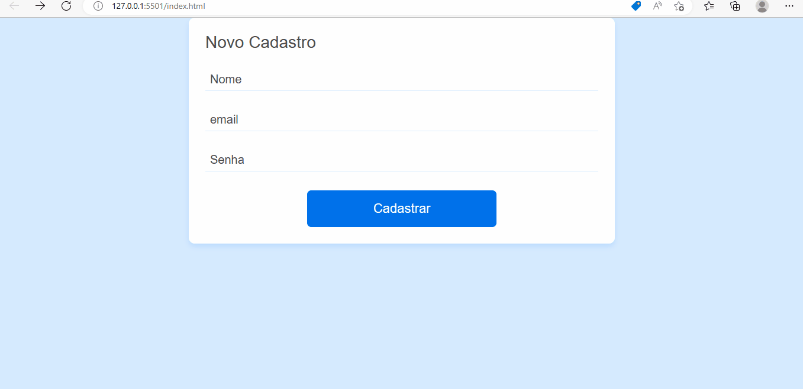

# Crud-na-Web
Este projeto é de um CRUD na web com a linguagem javascript usando o localstorage como opção de persistência.

### Features
Validação de formulário, verificando se o preenchimento está adequado de acordo com o tipo de input, além de usar expressões regulares para exigir que o usuário cadastre uma senha forte.

CRUD completo onde se pode cadastrar, listar, editar e deletar usuário. Como opção de persistência dos dados, a opção escolhida foi o localstorage do navegador.

Opção de filtrar os usuários cadastrados pelo nome e pelo email automaticamente a cada letra digitada.

### Features futuras
Adicionar a lógica de login - logout

### Para rodar o projeto
Depois de ter o projeto na sua maquina basta apenas ter um servidor instalado ccomo a live-server